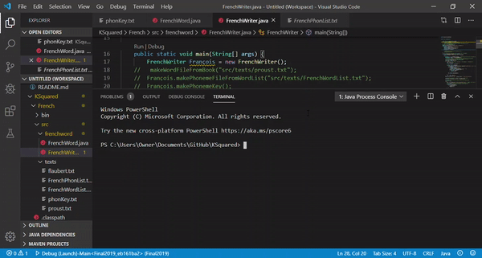

# KSquared
Our French Word and Phonemes and Audio Parser: 
We sought to produce the phonetic spelling, separated by phoneme, of a French word.

Organization:

-French
   -bin
   
     -src
           -frenchword
                    -FrenchWord      //the algorithm for creating phonetic spelling
                    -FrenchWriter    //the main file to run the Scanner and have phonetic output
                    
           -texts                   // the French texts we used to accumulate words, and the list of phonetic spellings produced during                                       //each run, as well as the phonetic pronunciation guide
           
    -classpath
    
    -project
    
-README

